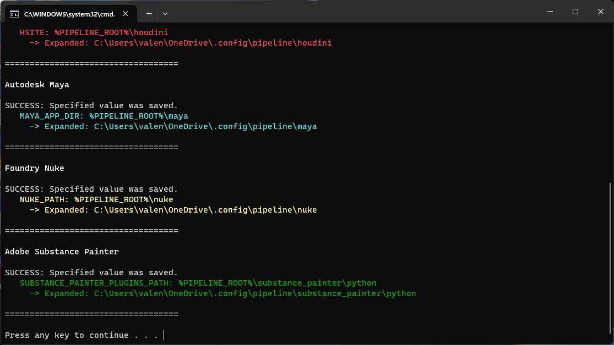

<div align="center">

  <a href="https://github.com/healkeiser/cloud_vfx_server">
    </a>

  <h3 align="center">Cloud VFX Server</h3>

  <p align="center">
    Setup cloud as a VFX server.
    <br/><br/>
  </p>

  ##

  <p align="center">
    <!-- Maintenance status -->
    &nbsp;&nbsp;
    <!--  -->
    <!-- License -->
    <!-- &nbsp;&nbsp; -->
    <!-- PyPI -->
    <!-- <a href="https://pypi.org/project/cloud_vfx_server">
      </a>&nbsp;&nbsp; -->
    <!-- Last Commit -->
    &nbsp;&nbsp;
    <!-- Commit Activity -->
    <a href="https://github.com/healkeiser/cloud_vfx_server/pulse" alt="Activity">
      </a>&nbsp;&nbsp;
    <!-- GitHub stars -->
    &nbsp;&nbsp;
  </p>

</div>


<!-- TABLE OF CONTENTS -->
## Table of Contents
<!--ts-->
   * [About](#about)
   * [Setup Server](#setup)
     * [Windows](#windows)
     * [Unix](#unix)
   * [Software](#software)
   * [Useful Resources and Tools](#useful-resources-and-tools)
   * [Contact](#contact)
<!--te-->


<!-- ABOUT -->
## About
Quick tutorial to setup a Cloud Server for multiple machines access, and VFX Pipeline on Windows, macOS and Linux.
This repository is based on [Google Drive VFX Server](https://github.com/healkeiser/google_drive_vfx_server), with loads of improvements.


<!-- SETUP SERVER -->
## Setup Server

First, you'll need to mount your Cloud server on your system, using any software you like ([rclone](https://rclone.org/), [Google Drive File Stream](https://support.google.com/a/answer/7491144?hl=en), etc.)

We can then start moving files around. The setup only relies on environment variables:
 - `SERVER_ROOT`: The root of the mounted Cloud server. This is the only value that needs to be changed depending on your setup
 - `CONFIG_ROOT`: The `.config` folder
 - `ENVIRONMENT_ROOT`: the `.config/environment` folder
 - `PIPELINE_ROOT`: the `.config/pipeline` folder

You can now download the code from this repository and extract its content to your `SERVER_ROOT`. Using `Z:/My Drive` as the mounted Cloud server path, it should look like this:

``` bash
.
└── 📁 Z:/My Drive/
    └── 📁 .config/
        ├── 📁 environment
        └── 📁 pipeline
```

Which equals to:

``` bash
.
└── 📁 $SERVER_ROOT/
    └── 📁 $CONFIG_ROOT/
        ├── 📁 $ENVIRONMENT_ROOT
        └── 📁 $PIPELINE_ROOT
```

You will need to modify `SERVER_ROOT` in [.zshrc](.config/environment/unix/.zshrc) (**Unix**) and/or [dcc.bat](.config/environment/windows/dcc.bat) (**Windows**) by your mounted Cloud server path:
- In [.zshrc](.config/environment/unix/.zshrc): `export SERVER_ROOT="Path/to/drive/linux"` (Line 12, 17, 21)
- In [dcc.bat](.config/environment/windows/dcc.bat): `setx SERVER_ROOT "Path\to\drive\windows"` (Line 9)

Once the folder structure is created and the `SERVER_ROOT` value has been modified, you can now assign the environment variables:

### Windows

**Windows** supports shell scripting after some [manipulations](https://walterteng.com/using-zsh-on-windows) but it's way easier to "*hard*" write the environment variables by running [dcc.bat](.config/environment/windows/dcc.bat).



To check that everything is working:
- Type <kbd> Win </kbd> + <kbd> I </kbd> to open the Windows Settings
- Scroll to the bottom of the page and click `About`
- Navigate to `Device Specifications` and press `Advanced System Settings`
- In the `System Properties` dialogue box, hit `Environmental Variables`
- The freshly created variables should be under `User`
- Check is `SERVER_ROOT` has been defined with the right path

### Unix

**macOS** and **Linux** are both Unix based OS.
The simplest way is to migrate your shell to `Zsh` using `chsh -s $(which zsh)` in your terminal.
You can then symlink [.zshrc](.config/environment/unix/.zshrc) in your `$HOME` folder.
To check that everything is working, restart your terminal and type `echo $SERVER_ROOT`: it should output your mounted Cloud server path.

> [!WARNING]
> [.zshrc](.config/environment/unix/.zshrc) needs to be called exactly that way in `$HOME` to be picked up by the terminal: remove any `alias` or `symlink` added in the name.

> [!WARNING]
> The `Make Alias` command in macOS Finder won't work properly. You should use this service instead to create proper Symlinks: [Symbolic Linker](https://github.com/nickzman/symboliclinker/releases)


<!-- SOFTWARE -->
## Software
This setup automatically links the following DCCs, using this folder structure:

``` bash
.
└── 📁 $SERVER_ROOT/
    └── 📁 .config/
        ├── 📁 environment
        └── 📁 pipeline/
            ├── 📁 houdini               ──> Using $HSITE
            ├── 📁 maya                  ──> Using $MAYA_APP_DIR
            ├── 📁 nuke                  ──> Using $NUKE_PATH
            ├── 📁 other
            └── 📁 substance_painter
                └── 📁 python            ──> Using $SUBSTANCE_PAINTER_PLUGINS_PATH
```

The DDCs can be launched normally on **Windows** if the [dcc.bat](.config/environment/windows/dcc.bat) file has been used to define the environment variables.

For **macOS** and **Linux**, you should start them from a terminal, in order to inherit the environment variables defined by [.zshrc](.config/environment/unix/.zshrc).

You can find an example script for Houdini just here: [houdini.sh](.config/environment/unix/houdini.sh).

To access it quickly, we also defined an alias for `houdini` pointing to that script in [aliases.sh](.config/environment/unix/aliases.sh). It will allow you to simply type this command to launch Houdini.

###  Maya

*WIP*
> [!NOTE]
> See [Maya file path variables](https://help.autodesk.com/view/MAYAUL/2022/ENU/?guid=GUID-228CCA33-4AFE-4380-8C3D-18D23F7EAC72)

``` bash
.
└── 📁 $SERVER_ROOT/
    └── 📁 .config/
        ├── 📁 environment
        └── 📁 pipeline/
            └── 📁 maya/
                └── 📁 2023/
                    ├── 📄 Maya.env
                    ├── 📁 prefs
                    ├── 📁 presets
                    └── 📁 scripts
```

###  Substance Painter

*WIP*
> **Note**<br>
> See [Substance Painter environment variables](https://substance3d.adobe.com/documentation/spdoc/environment-variables-172823292.html)

``` bash
.
└── 📁 $SERVER_ROOT/
    └── 📁 .config/
        ├── 📁 environment
        └── 📁 pipeline/
            └── 📁 substance_painter/
                └── 📁 python/
                    └── 📄 plugin.py
```

###  Houdini

Houdini will automatically scan the folder defined by `$HSITE` for any folder being named `houdini<houdini version>/<recognized folder>` such as `otls` or `packages` and load the content of those folders at Houdini startup.

> [!NOTE]
> See [Configuring Houdini](https://www.sidefx.com/docs/houdini/basics/config.html#path)

You can find two package file examples:
- A generic [plugin_name.json](.config/pipeline/houdini/houdini19.5/packages/plugin_name.json)
- An [arnold.json](.config/pipeline/houdini/houdini19.5/packages/arnold.json)

Both taking advantage of the environment variables posteriorly defined.

``` bash
.
└── 📁 $SERVER_ROOT/
    └── 📁 .config/
        ├── 📁 environment
        └── 📁 pipeline/
            └── 📁 houdini/
                └── 📁 houdini19.5/
                    ├── 📁 desktop
                    ├── 📁 otls/
                    │   └── 📄 digital_asset.hda
                    └── 📁 packages/
                        └── 📄 package.json
```

###  Nuke

Nuke will scan the content of the folder defined by `NUKE_PATH`, searching for `init.py` and `menu.py`.

> [!NOTE]
> See [What are the init.py and menu.py files](https://support.foundry.com/hc/en-us/articles/360003811839-Q100490-What-are-the-init-py-and-menu-py-files)

You can find an [init.py](.config/pipeline/nuke/init.py) file example, showing how to load plugins on Nuke startup.

``` bash
.
└── 📁 $SERVER_ROOT/
    └── 📁 .config/
        ├── 📁 environment
        └── 📁 pipeline/
            └── 📁 nuke/
                ├── 📄 init.py
                └── 📄 menu.py
```


<!-- RESSOURCES -->
## Useful Resources and Tools
- [HSITE](https://www.sidefx.com/docs/houdini/basics/config.html "SideFX: $HSITE")
- [Packages](https://www.sidefx.com/docs/houdini/ref/plugins.html "SideFX: Packages")


<!-- CONTACT -->
## Contact

Project Link: [Cloud VFX Server](https://github.com/healkeiser/cloud_vfx_server)

<p align='center'>
  <!-- GitHub profile -->
  <a href="https://github.com/healkeiser">
    </a>&nbsp;&nbsp;
  <!-- LinkedIn -->
  <a href="https://www.linkedin.com/in/valentin-beaumont">
    </a>&nbsp;&nbsp;
  <!-- Behance -->
  <a href="https://www.behance.net/el1ven">
    </a>&nbsp;&nbsp;
  <!-- X -->
  <a href="https://twitter.com/valentinbeaumon">
    </a>&nbsp;&nbsp;
  <!-- Instagram -->
  <a href="https://www.instagram.com/val.beaumontart">
    </a>&nbsp;&nbsp;
  <!-- Gumroad -->
  <a href="https://healkeiser.gumroad.com/subscribe">
    </a>&nbsp;&nbsp;
  <!-- Gmail -->
  <a href="mailto:valentin.onze@gmail.com">
    </a>&nbsp;&nbsp;
  <!-- Buy me a coffee -->
  <a href="https://www.buymeacoffee.com/healkeiser">
    </a>&nbsp;&nbsp;
</p>